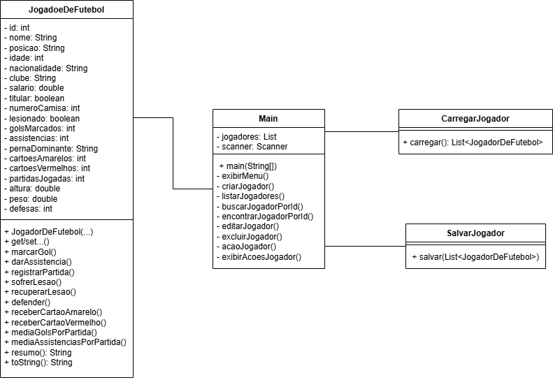

# Sistema de Cadastro de Jogadores de Futebol

Este é um projeto em Java que simula um sistema de gerenciamento de jogadores de futebol. O sistema funciona via console e permite realizar operações de cadastro, edição, ações e persistência de dados em arquivo `.txt`.

---

## ✅ Funcionalidades do sistema

- Cadastro de jogador com nome, idade, posição, clube, etc.
- Ações com jogador: marcar gols, dar assistências, registrar lesões, cartões, partidas, defesas
- Edição e exclusão de jogadores
- Armazenamento dos dados em um arquivo `jogadores.txt`
- Leitura automática do arquivo ao iniciar o programa
- Menu interativo no console
- Cálculo de estatísticas: média de gols, assistências e defesas por partida

---

## 🧱 Classes implementadas

### 🟩 `JogadorDeFutebol.java`
Classe principal com os atributos e métodos de cada jogador.

### 🟥 `Main.java`
Contém o menu principal e todas as funcionalidades (CRUD e ações com jogador).

### 🟦 `SalvaJogador.java`
Responsável por salvar todos os dados no arquivo `jogadores.txt`.

### 🟦 `CarregaJogador.java`
Responsável por carregar os dados salvos do arquivo `jogadores.txt` ao iniciar o sistema.

---

## 📐 Diagrama de Classes UML

O projeto também inclui um diagrama de classes UML representando a estrutura e relação entre as classes.



---

## ▶️ PARTE 1 – Como executar o programa

1. Compile todos os arquivos.


2. Execute o programa na classe `Main.java`.

3. No terminal, será exibido um menu com as opções disponíveis para criar, listar e editar jogadores.

---

## ▶️ PARTE 2 – Funcionamento do menu

### Menu principal:
```
1. Criar novo jogador
2. Listar todos os jogadores
3. Buscar jogador por ID
4. Ações com o jogador
5. Editar jogador
6. Excluir jogador
7. Sair
```

- O usuário pode navegar pelo menu digitando o número da opção desejada.
- As ações com o jogador incluem: marcar gols, assistências, lesões, cartões, registrar partidas e defesas.

---

## ▶️ PARTE 3 – Estrutura do arquivo jogadores.txt

- Os jogadores são armazenados no arquivo `jogadores.txt` de forma **automática** após qualquer modificação.
- O formato do arquivo é **CSV (valores separados por vírgula)** com os seguintes campos:

```
id,nome,posicao,idade,nacionalidade,clube,salario,titular,numeroCamisa,lesionado,
gols,assistencias,pernaDominante,amarelos,vermelhos,partidas,altura,peso,defesas
```

- Exemplo de linha:
```
1,Neymar,Atacante,32,Brasil,Al-Hilal,50000000.0,true,10,false,100,50,Direita,3,1,200,1.75,68.0,5
```

---

## ▶️ PARTE 4 – Diagrama UML

O diagrama de classes está incluído no projeto como imagem:

- A classe principal `JogadorDeFutebol`
- A classe que contém o menu e a lógica principal (`Main`)
- As classes de persistência: `SalvaJogador` e `CarregaJogador`
- As relações entre essas classes

---

## ✅ Conclusão

Este sistema simula de forma prática um gerenciamento completo de jogadores de futebol, com foco em reforçar os principais conceitos da programação orientada a objetos.

---

## 👤 Desenvolvido por
**Enrico, Luiz Guilherme e Mateus de Castro Aguiar**  
Programação de Soluções Computacionais
Avaliação A3

